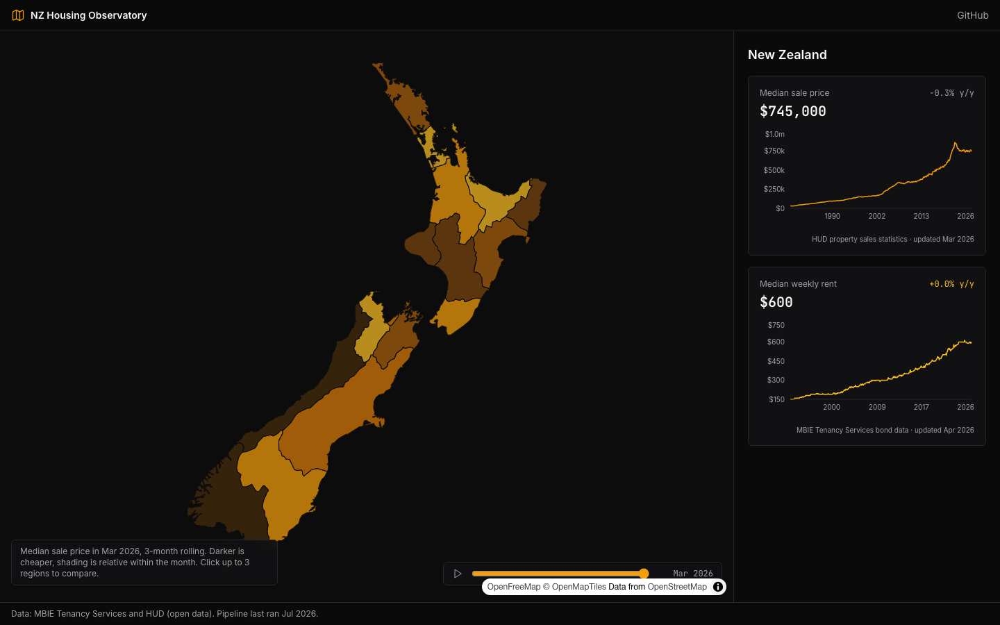
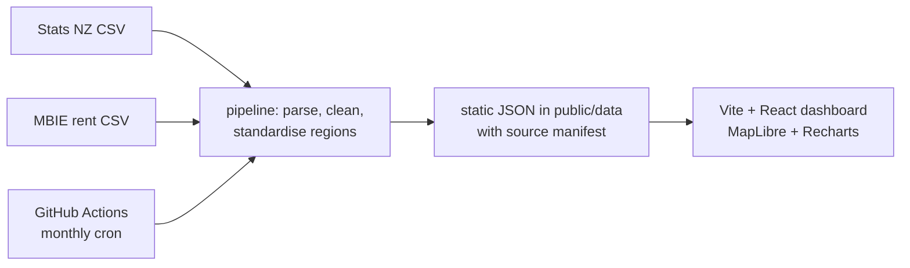

[](https://github.com/R1chi33333/nz-housing-observatory/actions/workflows/ci.yml)
[](https://codecov.io/gh/R1chi33333/nz-housing-observatory)
[](./LICENSE)

# NZ Housing Observatory — regional house prices and rents, mapped over time

[Live Demo](https://nz-housing-observatory.vercel.app) · [Documentation](#getting-started) · [Report Bug](https://github.com/R1chi33333/nz-housing-observatory/issues/new?template=bug_report.md)



## Why this exists

Housing dominates every New Zealand conversation, but the public numbers live in scattered spreadsheets on agency websites. This project turns open MBIE and Ministry of Housing (HUD) data into one interactive map: how prices and rents moved, region by region, year by year. No API keys, no paywalled data, and the cleaning pipeline is open and tested.

## Features

- Full-screen choropleth map of NZ regions (MapLibre GL, open basemap)
- Median house price and rent trend lines with year-on-year change
- Time slider to replay the map through the years
- Compare up to three regions on one chart
- Automated monthly data refresh via GitHub Actions
- Every chart annotated with its source and last-updated date

## Architecture



## Tech Stack

TypeScript (strict), Vite, React, MapLibre GL, Recharts, Tailwind CSS, Vitest. Data pipeline runs on plain Node. Deployed on Vercel.

## Getting Started

```bash
git clone https://github.com/R1chi33333/nz-housing-observatory.git
cd nz-housing-observatory
npm ci
npm run dev        # committed data, no network needed
npm run pipeline   # optional: rebuild public/data from the open datasets
```

The rent source needs a local Chrome to pass its bot challenge; see
[pipeline/SOURCES.md](./pipeline/SOURCES.md) for every dataset, licence,
cleaning decision and the story of why the pipeline stopped trusting the
data.govt.nz mirror.

## Testing

```bash
npm test               # pipeline and lib unit tests
npm run test:coverage  # with coverage report
npm run e2e            # Playwright: desktop map flow and mobile list flow
```

## Roadmap

See [ROADMAP.md](./ROADMAP.md).

## License

[MIT](./LICENSE). Data remains under the source agencies' open licences (CC BY 4.0).
